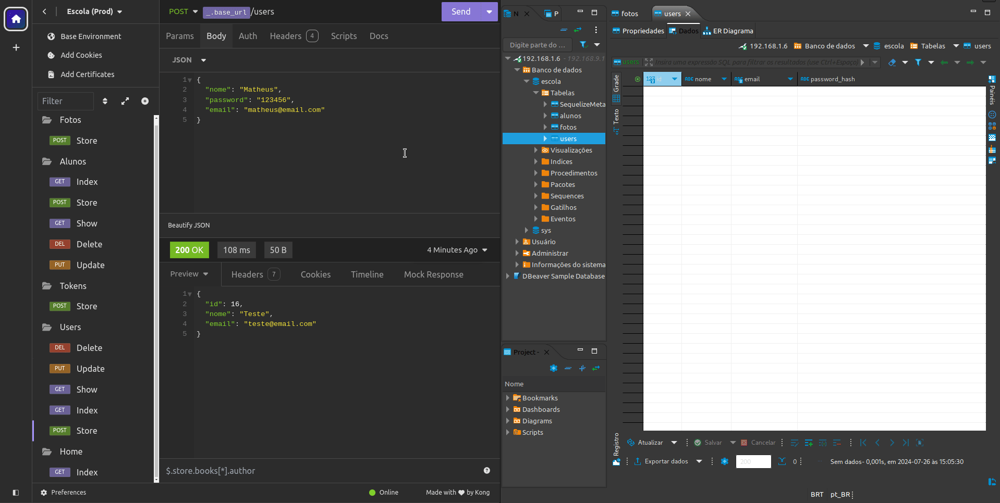

# Projeto de API REST

Projeto de API REST de uma escola construído no curso de Javascript e TypeScript - front-end e back-end (Full Stack) - Node, Express, noSQL, React, hooks, Redux e Design Patterns.

## Tecnologias praticadas neste projeto

- Eslint;
- Nodemon;
- Sucrase;
- Bcrypt.js;
- Node.js;
- Express;
- JWT;
- Dotenv;
- Sequelize;
- Multer;
- MariaDB;
- DBeaver;
- Google Cloud Platform;
- VirtualBox;
- Firewall
- SSH;
- PM2;
- Nginx.

## Funcionalidades do projeto

- Criação, atualização e exclusão de usuários;
- Geração de tokens para login dos usuários e uso do sistema;
- Criação, listagem (um ou todos), atualização e exclusão de alunos;
- Upload de fotos de alunos.

### Gif do projeto

